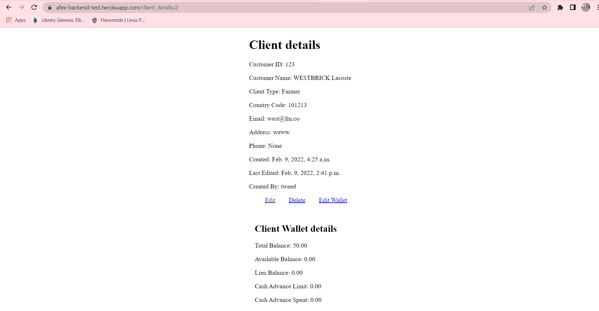
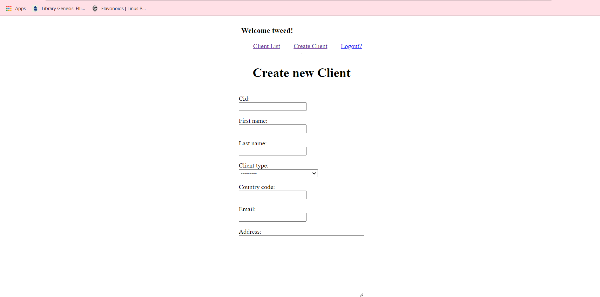
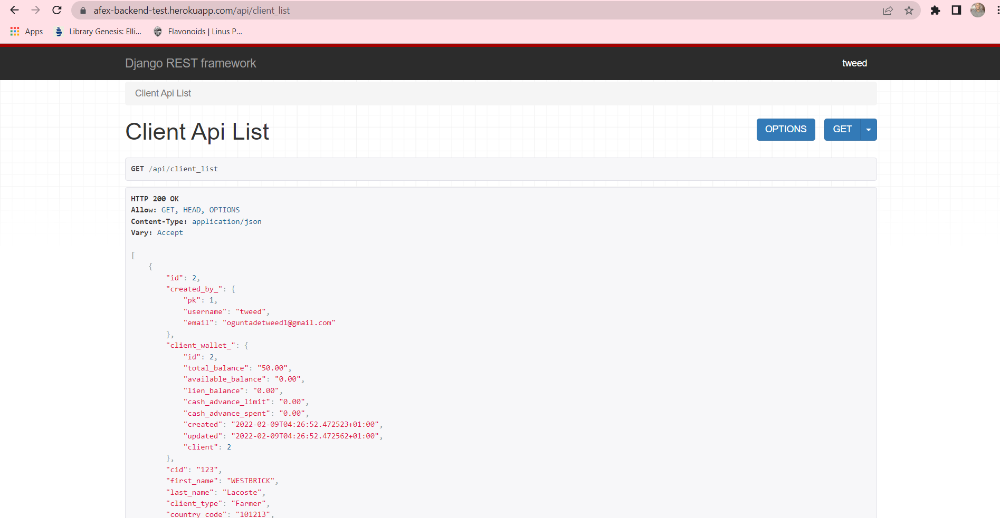
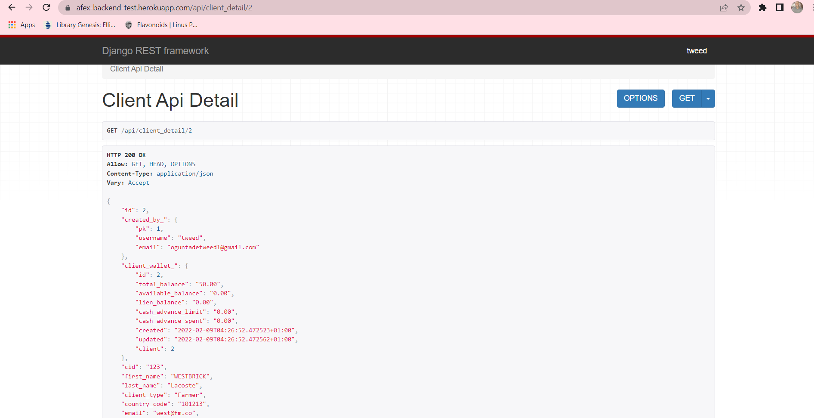

# AFEX Backend Dev Test

### Tasks

**Note**: **A deployed version of the aplication sits [here on Heroku](https://afex-backend-test.herokuapp.com/)**

1. [x] Get this app to work
2. [x] Change the database config to use PostgreSQL

   * Configured it so it uses a db.sqlite database in dev, a local postgres database in staging and an heroku postgres database in production.

3. [x] Config settings for dev, staging and production servers

4. [x] Add Two(2) security updates to the settings file
      
      * changed debug to False and added allowed hosts
      * Removed SECRET_KEY so it can only be accessed as an environment variable

5. [x] Add Two(1) performance updates to the settings file

      * Changed timezone from UTC to be gotten as an environment variable e.g Africa/Lagos
      * Configured static files directory settings.


A Django app has been created under `/apps/` called `crm`

1. [x] Configure this app to work with the main project

      * Added the app name to installed apps and migrated the db.

2. [x] Two models has been created for you: "Client" and "ClientWallet":

   a. Write a CRUD option with the Client Model

      * Requires authentication because the client model can only be created by logged in users.

   b. Write a PUT/POST option for the Client Wallet model (i.e ability to fund a particular client's wallet)

      * Ability to add or edit a wallet that is attached to a clients account.

   c. Write/Configure API endpoints to fetch client (including their wallet balance)

      * [Client list API](https://afex-backend-test.herokuapp.com/api/client_list) and

      * CLient Detail API where pk is the id.
         ```sh
          f'https://afex-backend-test.herokuapp.com/api/client_detail/{pk}'
         ```
      
   N:B You are to design an appropriate frontend for task in a & b above
3. Assuming you have been asked to tweak the code such that a client can have wallets in multiple currency, how will you approach this.

      * ANSWER: 


\*\*\* Optional

1. [x] Configured Docker for this project

      * Includes a Dockerfile and docker-compose.yml
      

### Sample Images

<details>
<summary>Client detail view with wallet details</summary>



<summary>Client creation view</summary>



<summary>Client list API view</summary>



<summary>Client detail API view</summary>




</details>


## Built With

- [Python](https://www.python.org/)
- [Django](https://www.djangoproject.com/)
- [Django Rest Framework](https://www.django-rest-framework.org/)
- [PostgreSQL](https://www.postgresql.org/)


# Prequisites

1. Python 3.8.5 ++

2. Clone this repository.

3. Setup virtual environment. Visit [here](https://docs.python.org/3/library/venv.html) for a detailed guide on how to setup virtualenv.

4. Install the project requirements:
    ```sh
    $ pip3 install -r requirements.txt
    ```

5. Set up `.env` file, all the necessary environment variables can be found in `.env.example`. It is necessary to note the following during env setup:
   * SET MODE to 'DEV' OR 'STAGING' OR 'PRODUCTION', note: DEV uses db.sqlite so no need for postgresql configuration.
   * SET SECRET_KEY to django secret key.
   * SET timezone, e.g Africa/Lagos
   * SET postgreSQL database credentials if using STAGING or PRODUCTION mode.

## DOCKER Prerequisites
> If you choose to use docker for this project then you can check the official [docker documentation](https://docs.docker.com/desktop/) for all the docker prerequisites depending on your os.

- if you cloned the github repository you can create your own docker image of this project using the command 
   ```sh
    $ docker-compose up
    ```
    ensure all the prior steps have been met.

- To clone the image from the docker hub without following any of the original prerequisites, use the command 
   ```sh
    $ docker pull tweedoriginal/afex_backend_test
    ```
    please make sure to set up the env for web using either the docker-compose.yml file or a seperate .env file has shown in step 5.

# Quickstart

1. Run the migrations:
    ```sh
    $ python manage.py migrate
    ```
    This is necessary for creating the tables and propagating model changes in the database schema. It only needs to be run once for this application.

2. Start the application locally on your system.
    ```sh
    $ python manage.py runserver
    ```

## To run with docker 
1. get the container-id using:

   ```sh
    $ docker ps -a 
    ```

2. Open a shell in the docker container:

   ```sh
    $ docker exec -it [container-id] bash -l 
    ```

3. Run the migrations in the container terminal: 
    ```sh
    $ python manage.py migrate
    ```
    This is necessary for creating the tables and propagating model changes in the database schema. It only needs to be run once for this application.

4. Start the application.
      ```sh
      $ docker-compose up 
      ```

# URLS

## LOGIN AND Registration to enable client creation

- Sign up = base_url/register/

- Login = base_url/login/

- Logout = base_url/logout/ 

## CRUD

- Create Client View = base_url/create_client

- Client List View = base_url: ''

- Client Details View = base_url/client_details/<int:pk> 

- Edit client Details View = base_url/edit_client/<int:pk> 

- Delete Client View = base_url/delete_client/<int:pk>


## PUT AND POST for client wallet

- Edit Client Wallet View = base_url/edit_wallet/<int:pk> 

- Create Client Wallet View = base_url/create_wallet/<int:pk>


## API Endpoints for fetching clients including wallets

- Client List API = base_url/api/client_list

- Client Details API = base_url/api/client_detail/<int:pk> 


## Author

**[Tawheed Oguntade](https://github.com/TWEEDOriginal/)**
